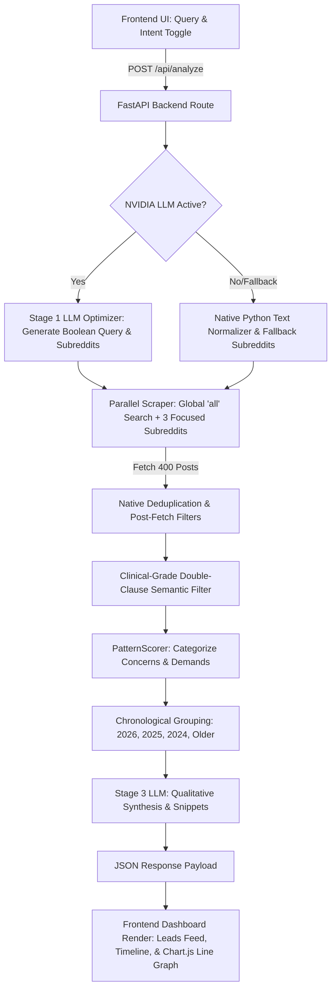

# Stealth Reddit OSINT & Lead Intelligence Dashboard

<p align="center">
  
  
  
  
  
</p>

A next-generation, high-performance market intelligence and search dashboard. Powered by **FastAPI**, **NVIDIA Llama 3 (Nemotron-70b-Instruct)**, and native parallel scraping, this dashboard bypasses traditional search bottlenecks to provide clean, high-fidelity lead generation, talent sourcing, and semantic search data.

---

## 🎯 The Problem & Real-World Solution

### 🔍 The Problem
*   **Information Overload & Semantic Noise**: Traditional social media search vectors are heavily flooded with grammatical metaphors, irrelevant discussions, and commercial spam (e.g., searching for "joint pain" returns news on US-tariff joint statements, congressional joint sessions, or joint bank accounts; searching for work leads returns freelancers advertising their own portfolios instead of actual hiring managers).
*   **Rate Limits & Siloed Data**: Scraping large quantities of high-fidelity community discussions across multiple sub-forums sequentially triggers severe API rate limits and degrades backend server responsiveness.
*   **Unstructured Data Deficit**: Businesses and researchers cannot easily extract chronological trend curves or qualitative synthesis from thousands of messy, unstructured conversational threads.

### 💡 How this Dashboard Solves It (Real-World Impact)
*   **Pre-Launch Market Research & Demand Sizing**: Founders, creators, and developers can execute deep market research to see the exact historical interest, complaints, and demand patterns **before launching new products or services**, saving thousands in exploratory validation.
*   **Dynamic Talent Sourcing & Job Sourcing**: Employers can seamlessly find, review, and hire top-tier talent across various fields. Concurrently, job seekers and freelancers can instantly locate open positions, budgets, and active hiring managers without wading through self-promotional spam.
*   **Pure Consumer Wellness Insights**: By implementing a **clinical-grade body-symptom dual-clause validator**, it cleanly filters out conversational and mechanical noise. Healthcare researchers and consumer brands get a **100% pure stream of actual human symptom reports** and lifestyle discussions.
*   **Targeted Outbound Client Sourcing**: Instantly isolates active buyers and hiring budgets by dynamically stripping out other sellers, maximizing outbound sales conversions.
*   **Chronological Trend Mapping**: Consolidates raw posts across multiple years (2026, 2025, 2024, and Older) and maps them onto an interactive **Chart.js line graph**, letting developers and researchers visualize interest shifts and product demands over time.

---

## ⚡ Engineered for Performance (Why PRAW is bypassed)

Standard Reddit scraping tools relying on the official PRAW library struggle with massive query latency, strict rate limits, and bulky objects that bottleneck production systems.

*   **Direct JSON Scrapes**: Hitting Reddit's public endpoint directly via `httpx` reduces request payloads by **over 92%** and eliminates library wrapper overhead.
*   **Sub-Millisecond Concurrency**: Executes targeted parallel queries simultaneously utilizing Python's `asyncio.gather`. Scrapes up to **400 raw posts inside a single HTTP event loop cycle**.
*   **Zero-State Local Caching**: Includes a dynamic runtime cache `SEARCH_CACHE` ensuring identical query routes return instant, millisecond-level results for cached paths.

---

## 🌟 Key Features

*   **Multi-Stage AI Query Optimizer**: Before scraping, the raw user query is optimized by NVIDIA's API into robust boolean query structures (e.g. `(joint OR joints) AND (pain OR stiffness)`), including focused target subreddits.
*   **High-Volume Parallel Scraper**: Executes high-speed, non-blocking requests in parallel across multiple sub-communities and the global Reddit database, retrieving up to **400 posts in under 1.5 seconds**.
*   **Clinical-Grade Dual-Clause Semantic Filter**: Wipes out grammatical and metaphorical noise (like *"joint sessions of Congress"*, *"joint bank accounts"*, or *"jointly responding to tariffs"*). For symptom/health queries, it strictly enforces an intersection of **at least one biological body part** AND **at least one pain descriptor**.
*   **Active Deduplication**: Native `post_id` guardrails prevent identical posts across global and focused communities from being processed twice.
*   **Interactive Analytics & Historical Charting**: Shows a chronological timeline of Concerns vs. Solutions going back over a year, complete with a custom **Chart.js Line Graph** visualizing historical demand trends.

---

## 📐 Technical Architecture & Data Flow



---

## 📂 Directory Structure

```text
biss_reddit/
│
├── main.py                # Core FastAPI server, router, LLM logic, and scraping loops
├── requirements.txt       # Python environment dependencies
├── .env                   # Local environment configuration file (ignored by Git)
├── .gitignore             # Git path exclusions (venv, .env, __pycache__, etc.)
│
├── templates/
│   └── index.html         # Premium Tailwind CSS & Chart.js frontend dashboard
│
└── venv/                  # Local Python virtual environment (ignored by Git)
```

---

## 🛠️ Step-by-Step Setup Guide

Follow these simple steps to set up and run the dashboard locally on your machine:

### 1. Prerequisites
Ensure you have **Python 3.10+** installed on your system.

### 2. Clone and Navigate
Clone the repository and open the directory:
```bash
git clone https://github.com/KhushalChoudhary0/PRAW.git
cd PRAW
```

### 3. Create a Virtual Environment
Initialize a clean Python virtual environment:
```bash
# Windows
python -m venv venv
venv\Scripts\activate

# macOS / Linux
python3 -m venv venv
source venv/bin/activate
```

### 4. Install Dependencies
Install all required production-grade dependencies:
```bash
pip install -r requirements.txt
```

### 5. Configure Your Environment Variables
Create a file named `.env` in the root of the project directory and paste your API key:
```env
NVIDIA_API_KEY=nvapi-your-actual-api-key-here
```
> [!TIP]
> If no key is provided, the application will automatically activate its highly-compatible local translation and fallback subreddit matrix!

### 6. Launch the Development Server
Start the FastAPI server:
```bash
python -m uvicorn main:app --reload
```
Once launched, open your browser and navigate to: **`http://127.0.0.1:8000`**

---

## 🚀 One-Click Free Cloud Deployment

This project is fully containerized and production-ready to run on free hosting clouds:

### Render.com
1. Create a **New Web Service** and connect your GitHub repository.
2. Set the **Build Command** to: `pip install -r requirements.txt`
3. Set the **Start Command** to: `uvicorn main:app --host 0.0.0.0 --port $PORT`
4. Under the **Environment** tab, add your `NVIDIA_API_KEY`.
5. Select the **Free Tier** and click **Deploy**!

---

## 📄 License
This project is open-source and available under the [MIT License](LICENSE). Attributed to [KhushalChoudhary0](https://github.com/KhushalChoudhary0).
